# Dokumentasi Hasil Testing Semua Endpoint Via Swagger/Thunder  Client

1. POST/items - Buat 3 item 

   - Laptop

     
     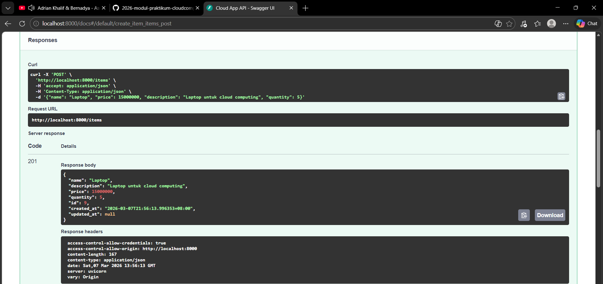
     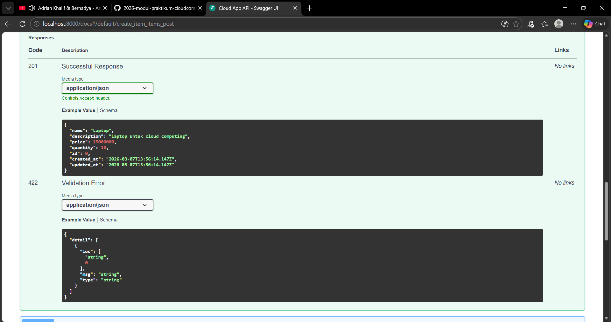

        Gambar tersebut menampilkan proses pengujian endpoint API **POST /items** menggunakan **Swagger UI** pada alamat `http://localhost:8000/docs`. Endpoint ini digunakan untuk menambahkan data item baru ke dalam sistem. Pada tampilan tersebut dijelaskan beberapa atribut yang harus diisi, yaitu **name** sebagai nama item, **price** sebagai harga, **description** sebagai deskripsi (opsional), serta **quantity** sebagai jumlah stok.

        Pada bagian **Request Body**, data dikirim dalam format **JSON** dengan contoh input berupa item *Laptop* dengan harga **15000000**, deskripsi *Laptop untuk cloud computing*, dan jumlah stok **5**. Setelah permintaan dikirim, server memberikan respons dengan kode **201 (Successful Response)** yang menandakan bahwa data berhasil dibuat. Respons yang ditampilkan berisi data item yang telah tersimpan di sistem, termasuk **id** yang dibuat otomatis serta informasi waktu pembuatan data (**created_at**).

        Selain itu, Swagger juga menampilkan kemungkinan **Validation Error (422)** apabila data yang dikirim tidak sesuai dengan aturan yang telah ditentukan. Tampilan ini menunjukkan bahwa Swagger UI dapat digunakan untuk mendokumentasikan sekaligus menguji API secara langsung.

   - Mouse Wireless

     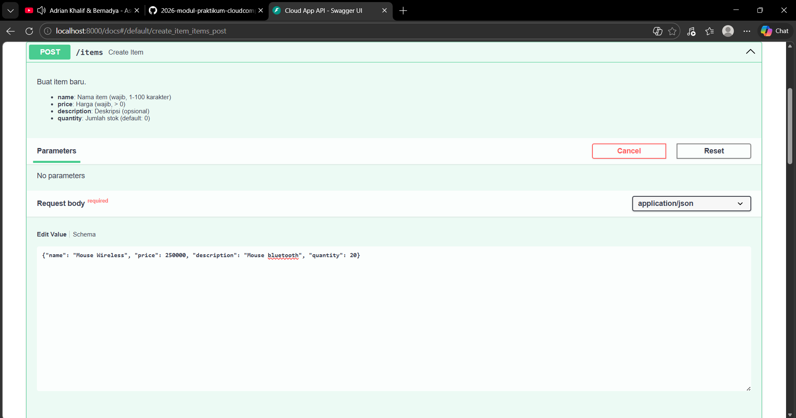
     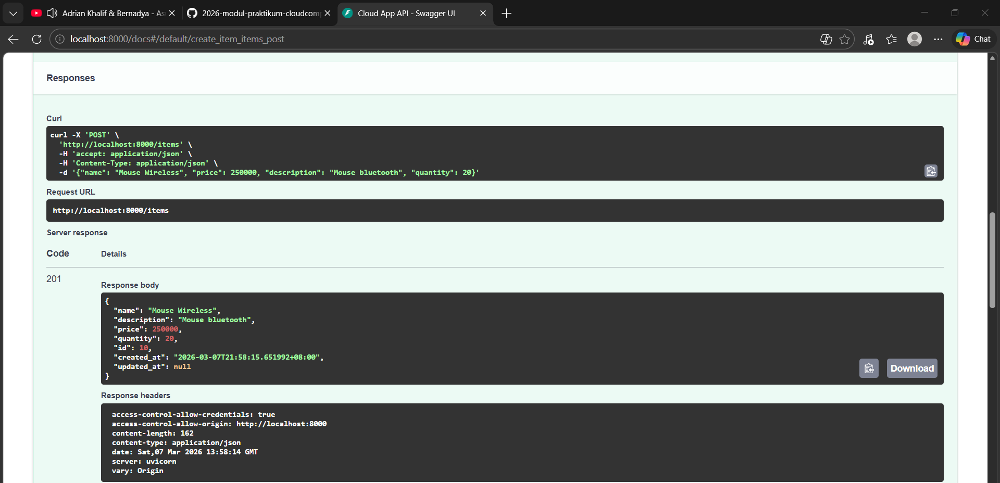
     

        Gambar tersebut menampilkan proses pengujian endpoint API **POST /items** menggunakan **Swagger UI** pada alamat `http://localhost:8000/docs`. Endpoint ini digunakan untuk menambahkan data item baru ke dalam sistem. Pada tampilan tersebut dijelaskan beberapa atribut yang harus diisi, yaitu **name** sebagai nama item, **price** sebagai harga, **description** sebagai deskripsi (opsional), serta **quantity** sebagai jumlah stok.

        Pada bagian **Request Body**, data dikirim dalam format **JSON** dengan contoh input berupa item *Mouse Wireless* dengan harga **250000**, deskripsi *Mouse bluetooth*, dan jumlah stok **20**. Setelah permintaan dikirim, server memberikan respons dengan kode **201 (Successful Response)** yang menandakan bahwa data berhasil dibuat. Respons yang ditampilkan berisi data item yang telah tersimpan di sistem, termasuk **id** yang dibuat otomatis serta informasi waktu pembuatan data (**created_at**).

        Selain itu, Swagger juga menampilkan kemungkinan **Validation Error (422)** apabila data yang dikirim tidak sesuai dengan aturan yang telah ditentukan. Tampilan ini menunjukkan bahwa Swagger UI dapat digunakan untuk mendokumentasikan sekaligus menguji API secara langsung.

   - Keyboard Mechanical

     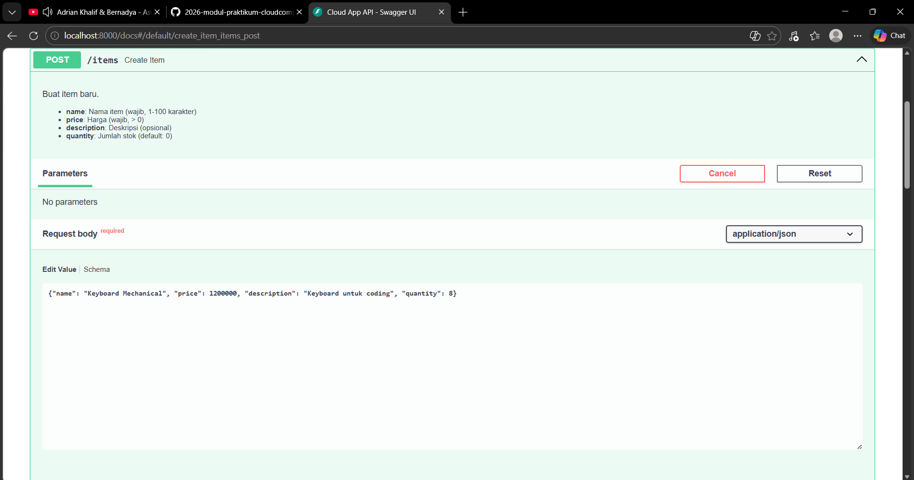
     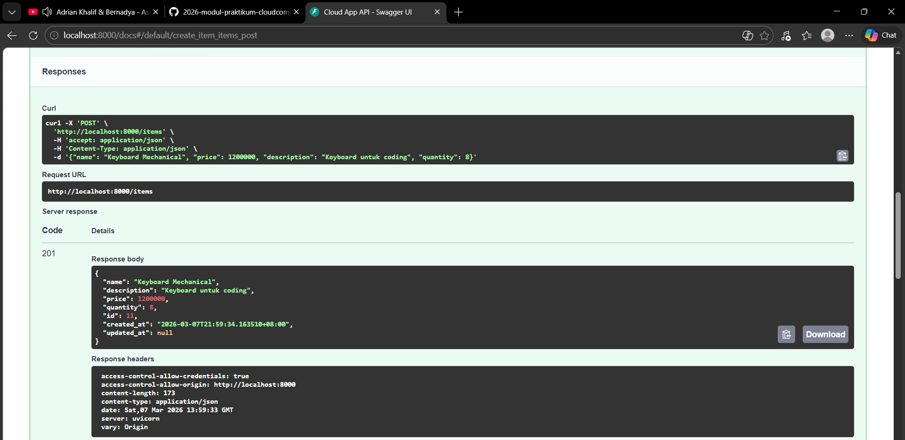
     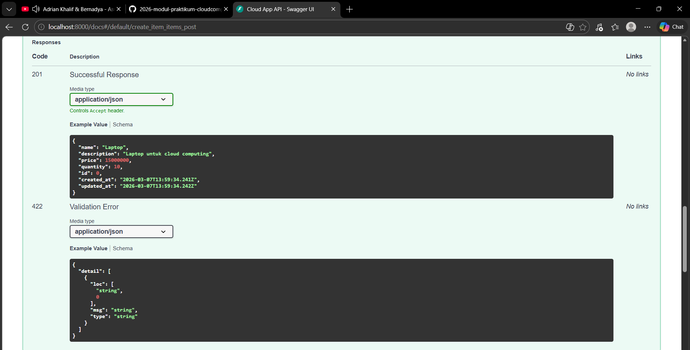

        Gambar tersebut menampilkan proses pengujian endpoint API **POST /items** menggunakan **Swagger UI** pada alamat `http://localhost:8000/docs`. Endpoint ini digunakan untuk menambahkan data item baru ke dalam sistem. Pada tampilan tersebut dijelaskan beberapa atribut yang harus diisi, yaitu **name** sebagai nama item, **price** sebagai harga, **description** sebagai deskripsi (opsional), serta **quantity** sebagai jumlah stok.

        Pada bagian **Request Body**, data dikirim dalam format **JSON** dengan contoh input berupa item *Keyboard Mechanical* dengan harga **1200000**, deskripsi *Keyboard untuk coding*, dan jumlah stok **8**. Setelah permintaan dikirim, server memberikan respons dengan kode **201 (Successful Response)** yang menandakan bahwa data berhasil dibuat. Respons yang ditampilkan berisi data item yang telah tersimpan di sistem, termasuk **id** yang dibuat otomatis serta informasi waktu pembuatan data (**created_at**).

        Selain itu, Swagger juga menampilkan kemungkinan **Validation Error (422)** apabila data yang dikirim tidak sesuai dengan aturan yang telah ditentukan. Tampilan ini menunjukkan bahwa Swagger UI dapat digunakan untuk mendokumentasikan sekaligus menguji API secara langsung.

2. GET /items — Harus mengembalikan 3 items dengan total : 3

   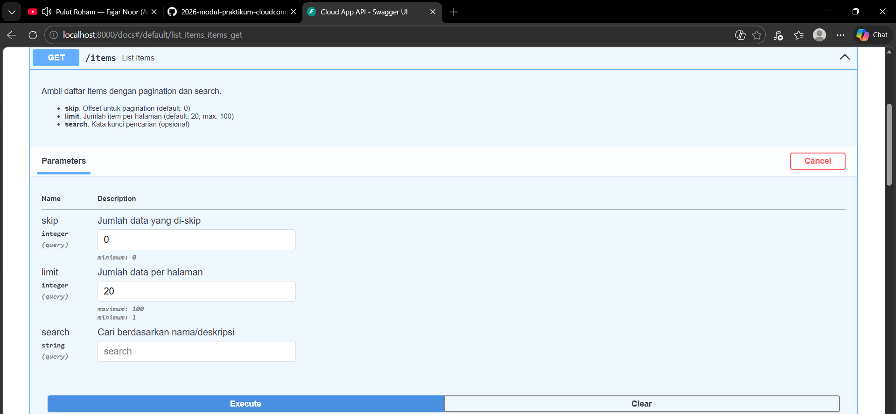
   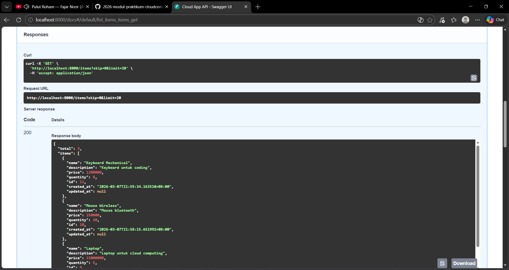
   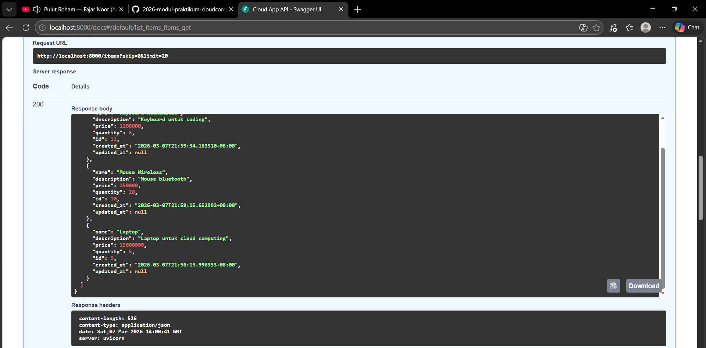
   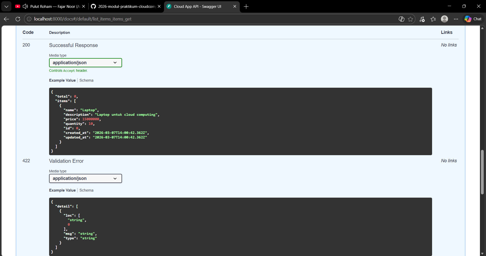

    Gambar tersebut menunjukkan dokumentasi dan hasil pengujian dari endpoint **GET /items** yang berfungsi untuk mengambil daftar item. Endpoint ini mendukung fitur pagination menggunakan parameter `skip` untuk mengatur jumlah data yang dilewati dan `limit` untuk membatasi jumlah item yang ditampilkan per halaman, dengan nilai default 20 dan maksimal 100. Selain itu, terdapat parameter opsional `search` yang dapat digunakan untuk mencari item berdasarkan nama atau deskripsi.

    Pengujian dilakukan dengan mengirimkan permintaan **GET** menggunakan cURL ke URL `http://localhost:8000/items?skip=0&limit=20`. Server kemudian merespons dengan kode status **200 OK** yang menandakan permintaan berhasil. Respons yang dikembalikan berupa JSON yang berisi objek `total` dengan nilai **3** yang menunjukkan jumlah seluruh item yang tersedia, serta array `items` yang berisi **3 item**, yaitu **Keyboard Mechanical, Mouse Wireless, dan Laptop**. Setiap item dalam array dilengkapi dengan informasi lengkap seperti nama, deskripsi, harga, jumlah stok, ID unik, serta waktu pembuatan dan pembaruan. Dokumentasi ini memudahkan pengembang untuk memahami cara kerja pengambilan data secara efisien dengan sistem pagination.

3. GET /items/{item_id} — Harus mengembalikan item Laptop

   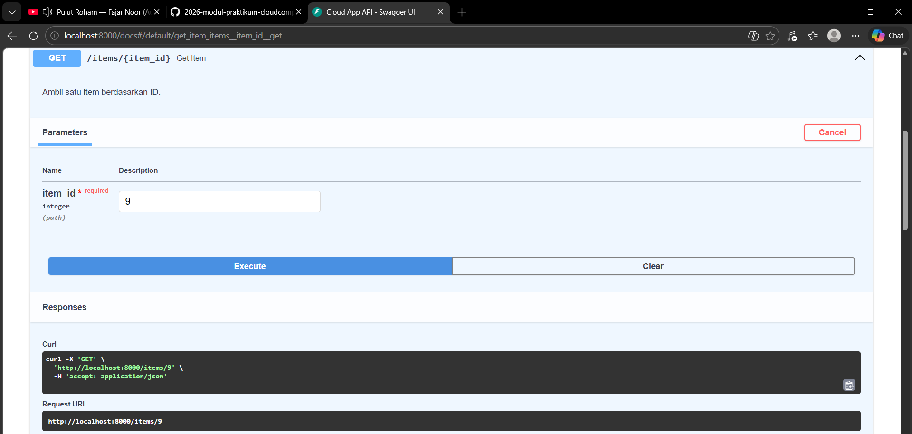
   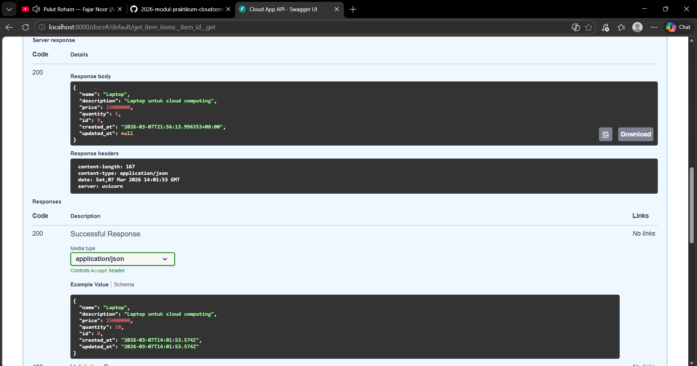
   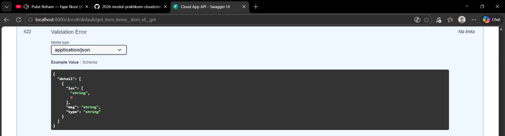

    Gambar tersebut menunjukkan dokumentasi dan hasil pengujian dari endpoint **GET /items/{item_id}** yang berfungsi untuk mengambil satu item berdasarkan ID tertentu. Endpoint ini memerlukan parameter `item_id` yang wajib disertakan pada path URL untuk menentukan item mana yang ingin diambil datanya.

    Pengujian dilakukan dengan mengirimkan permintaan **GET** menggunakan cURL ke URL `http://localhost:8000/items/9` yang berarti mengambil item dengan ID 9. Server kemudian merespons dengan kode status **200 OK** yang menandakan permintaan berhasil. Respons yang dikembalikan berupa JSON berisi data lengkap item dengan ID 9, yaitu **Laptop**, mencakup informasi seperti nama, deskripsi, harga Rp15000000, quantity 5, ID unik, serta waktu pembuatan dan pembaruan. Dokumentasi ini juga mencakup kemungkinan terjadinya **kesalahan validasi** dengan kode status **422**, yang dapat terjadi jika parameter yang dikirim tidak sesuai, misalnya format ID tidak valid.

4. PUT /items/{item_id} — Update harga Laptop : 14000000

   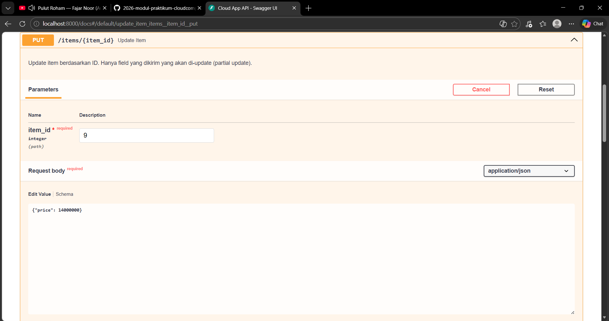
   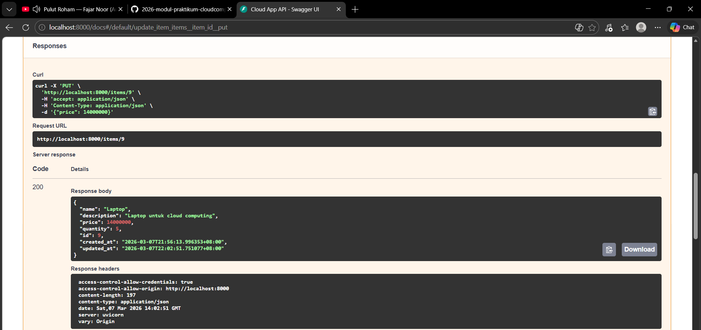
   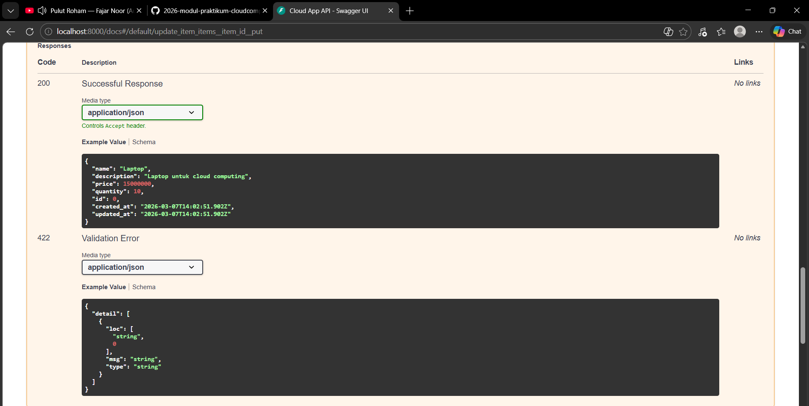

    Gambar tersebut menunjukkan dokumentasi dan hasil pengujian dari endpoint **PUT /items/{item_id}** yang berfungsi untuk melakukan pembaruan pada item berdasarkan ID. Endpoint ini menerapkan sistem *partial update*, yang berarti hanya field yang dikirim dalam body permintaan yang akan diperbarui, sementara field lainnya tetap sesuai dengan data yang sudah ada.

    Pengujian dilakukan dengan mengirimkan permintaan **PUT** menggunakan cURL ke URL `http://localhost:8000/items/9` untuk memperbarui item dengan ID 9. Data yang dikirim dalam body permintaan hanya berupa field `price` dengan nilai baru Rp14000000. Server kemudian merespons dengan kode status **200 OK** yang menandakan pembaruan berhasil dilakukan. Respons yang dikembalikan berupa JSON berisi data item **Laptop** setelah diperbarui, dimana harga telah berubah menjadi Rp14000000 sementara field lain seperti nama, deskripsi, dan quantity tetap sama. Perbedaan signifikan terlihat pada field `updated_at` yang kini terisi dengan waktu pembaruan, menunjukkan bahwa item tersebut telah dimodifikasi. Dokumentasi ini juga mencakup kemungkinan kesalahan validasi dengan kode **422** jika data yang dikirim tidak sesuai dengan ketentuan yang berlaku.

5. GET /items/{item_id} — Harga Laptop harus berubah ke 14000000

   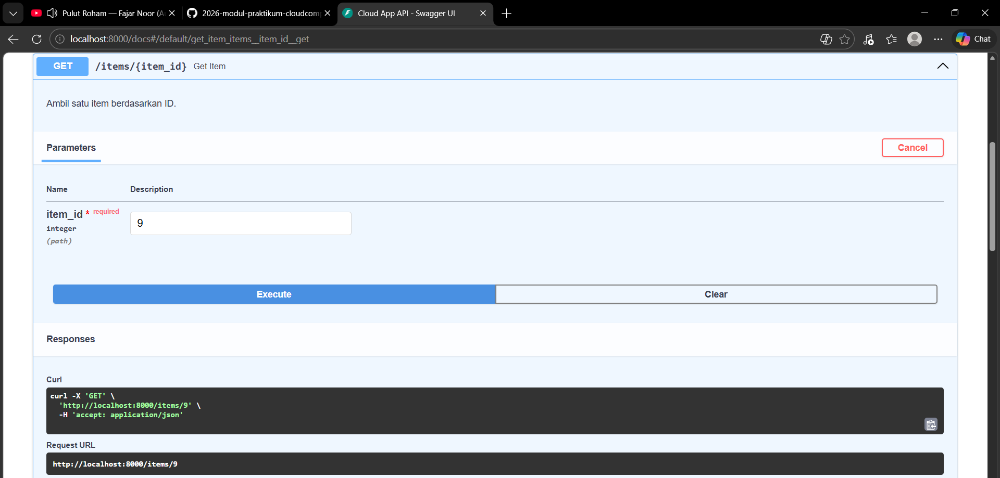
   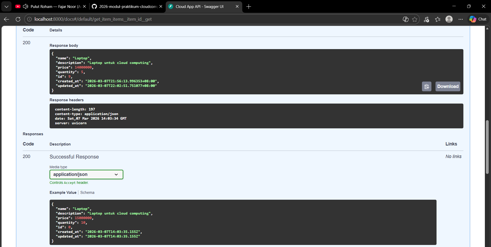
   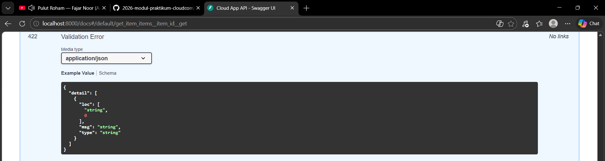

    Gambar tersebut menunjukkan dokumentasi dan hasil pengujian dari endpoint **GET /items/{item_id}** yang berfungsi untuk mengambil satu item berdasarkan ID tertentu. Pengujian ini dilakukan setelah proses pembaruan harga pada item ID 9 untuk memastikan bahwa perubahan telah tersimpan dengan benar.

    Pengujian dilakukan dengan mengirimkan permintaan **GET** menggunakan cURL ke URL `http://localhost:8000/items/9` yang berarti mengambil item dengan ID 9. Server kemudian merespons dengan kode status **200 OK** yang menandakan permintaan berhasil. Respons yang dikembalikan berupa JSON berisi data lengkap item **Laptop** yang telah diperbarui sebelumnya, dimana harga kini menunjukkan Rp14000000 sesuai dengan perubahan yang dilakukan pada endpoint PUT, serta field `updated_at` yang sudah terisi dengan waktu pembaruan. Hal ini membuktikan bahwa proses pembaruan data telah berhasil dan tersimpan di server. Dokumentasi ini juga mencakup kemungkinan terjadinya **kesalahan validasi** dengan kode status **422**, yang dapat terjadi jika parameter ID yang dikirim tidak valid atau tidak ditemukan dalam sistem.

6. GET /items?search=laptop — Harus mengembalikan 1 item

   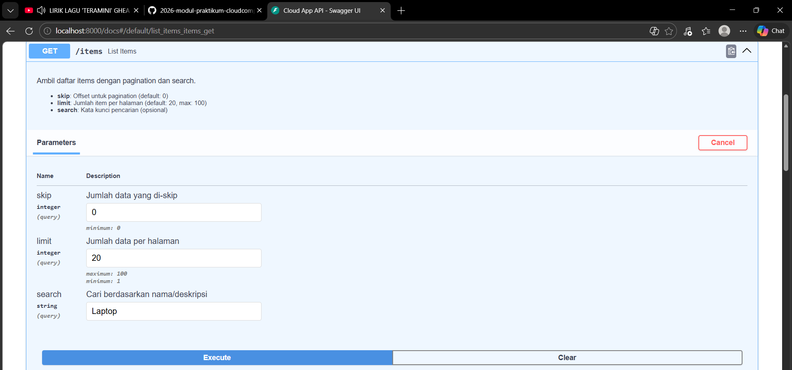
   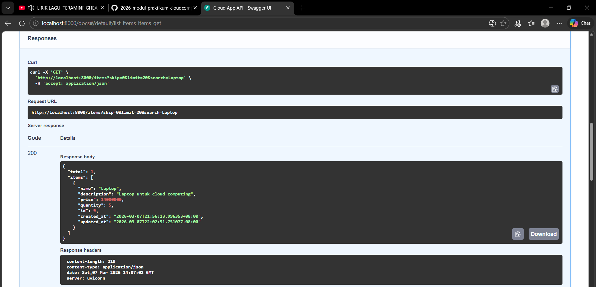
   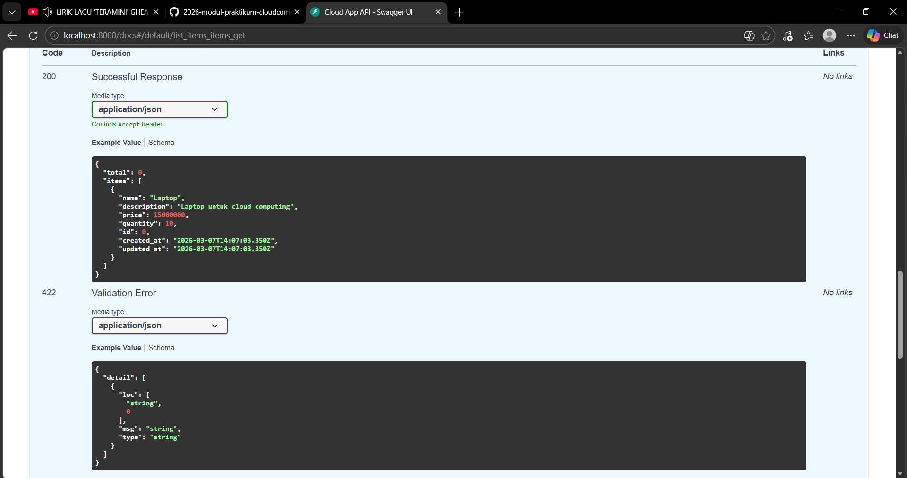

    Gambar tersebut menunjukkan dokumentasi dan hasil pengujian dari endpoint **GET /items** dengan memanfaatkan fitur pencarian (*search*). Endpoint ini berfungsi untuk mengambil daftar item dan mendukung pagination menggunakan parameter `skip` dan `limit`, serta parameter opsional `search` untuk mencari item berdasarkan nama atau deskripsi.

    Pengujian dilakukan dengan mengirimkan permintaan **GET** menggunakan cURL ke URL `http://localhost:8000/items?skip=0&limit=20&search=Laptop`, dimana parameter `search` diisi dengan kata kunci "Laptop". Server kemudian merespons dengan kode status **200 OK** yang menandakan permintaan berhasil. Respons yang dikembalikan berupa JSON yang berisi objek `total` dengan nilai **1** yang menunjukkan hanya ditemukan satu item yang sesuai dengan kata kunci pencarian, serta array `items` yang berisi item **Laptop** dengan harga Rp14000000 dan quantity 5. Hal ini membuktikan bahwa fitur pencarian berfungsi dengan baik karena hanya mengembalikan item yang mengandung kata "Laptop" pada nama atau deskripsinya. Dokumentasi ini juga mencakup contoh respons sukses beserta skema data yang dihasilkan, serta kemungkinan terjadinya kesalahan validasi dengan kode status **422** jika parameter yang dikirim tidak sesuai dengan ketentuan yang berlaku.

7.  Endpoint GET /items/stats - Return : total items, total value (sum of price × quantity), item termahal, item termurah

    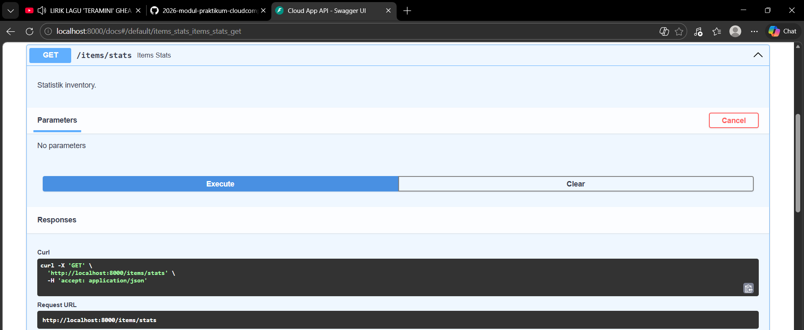
    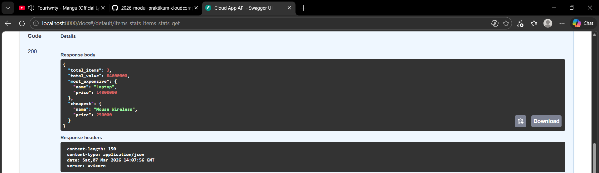
    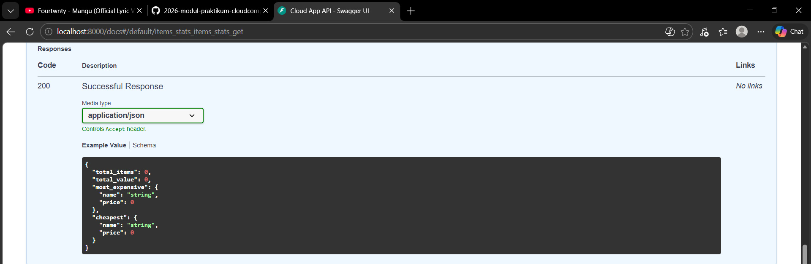

    Gambar tersebut menunjukkan dokumentasi dan hasil pengujian dari endpoint **GET /items/stats** yang berfungsi untuk menampilkan statistik inventory atau ringkasan data dari seluruh item yang tersedia. Endpoint ini tidak memerlukan parameter apapun dalam penggunaannya.

    Pengujian dilakukan dengan mengirimkan permintaan **GET** menggunakan cURL ke URL `http://localhost:8000/items/stats`. Server kemudian merespons dengan kode status **200 OK** yang menandakan permintaan berhasil. Respons yang dikembalikan berupa JSON yang berisi informasi statistik lengkap, yaitu `total_items` dengan nilai **3** yang menunjukkan jumlah seluruh item yang tersedia, `total_value` sebesar **Rp84600000** yang merupakan total nilai dari seluruh item (hasil perkalian harga dengan quantity masing - masing item), serta informasi mengenai item termahal (*most expensive*), yaitu **Laptop** dengan harga Rp14000000 dan item termurah (*cheapest*), yaitu **Mouse Wireless** dengan harga Rp250000. Secara keseluruhan, endpoint ini sangat membantu dalam memberikan gambaran umum mengenai kondisi inventory secara cepat, ringkas, dan efisien. Dengan adanya endpoint GET /items/stats, pengembang maupun pengguna sistem dapat mengetahui jumlah item, total nilai inventory, serta perbandingan harga item tertinggi dan terendah tanpa harus melihat data setiap item secara satu per satu.

8. DELETE /items/{item_id} — Laptop harus response 204

   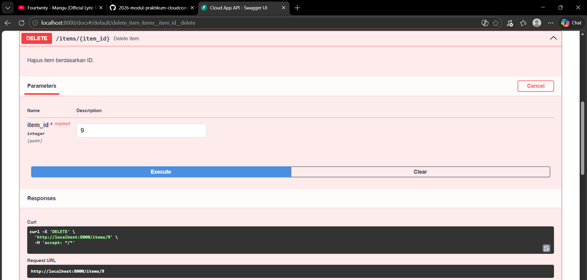
   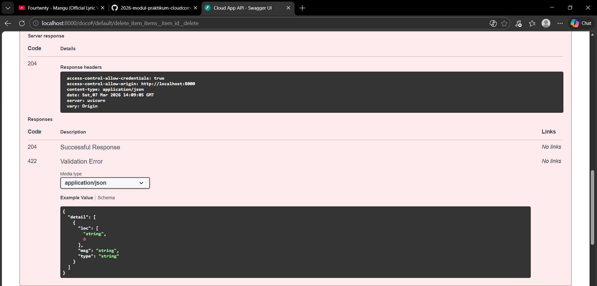

    Gambar tersebut menunjukkan dokumentasi dan hasil pengujian dari endpoint **DELETE /items/{item_id}** yang berfungsi untuk menghapus item berdasarkan ID tertentu. Endpoint ini memerlukan parameter `item_id` yang wajib disertakan pada path URL untuk menentukan item mana yang ingin dihapus dari sistem.

    Pengujian dilakukan dengan mengirimkan permintaan **DELETE** menggunakan cURL ke URL `http://localhost:8000/items/9` yang berarti menghapus item dengan ID 9, yaitu **Laptop**. Server kemudian merespons dengan kode status **204 No Content** yang menandakan permintaan penghapusan berhasil dilakukan. Berbeda dengan respons sebelumnya yang menyertakan body, kode 204 tidak mengembalikan body respons, hanya header sebagai konfirmasi bahwa item telah berhasil dihapus dari database. Dokumentasi ini juga mencakup kemungkinan terjadinya **kesalahan validasi** dengan kode status **422**, yang dapat terjadi jika parameter ID yang dikirim tidak valid atau item dengan ID tersebut tidak ditemukan dalam sistem.

9. GET /items/{item_id} — Laptop harus response 404

   
   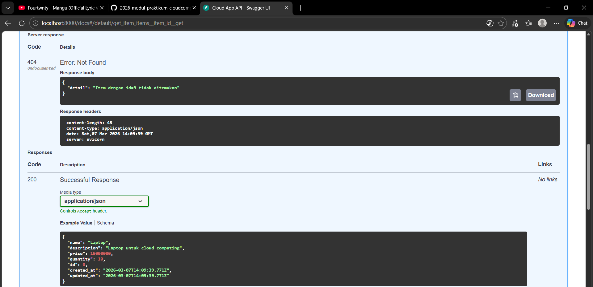
   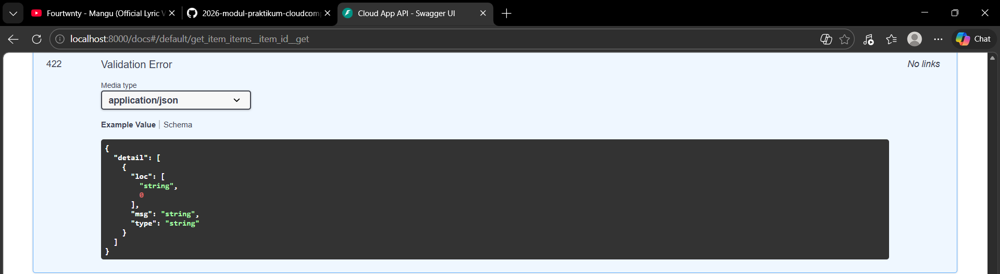
      
    Gambar tersebut menunjukkan dokumentasi dan hasil pengujian dari endpoint **GET /items/{item_id}** yang dilakukan setelah proses penghapusan item. Pengujian ini bertujuan untuk memastikan bahwa item dengan ID 9 benar-benar telah terhapus dari sistem.

    Pengujian dilakukan dengan mengirimkan permintaan **GET** menggunakan cURL ke URL `http://localhost:8000/items/9` untuk mencoba mengambil data item yang sebelumnya telah dihapus. Server kemudian merespons dengan kode status **404 Not Found** yang menandakan bahwa item yang diminta tidak ditemukan dalam database. Respons yang dikembalikan berupa JSON berisi pesan keterangan **"Item dengan id=9 tidak ditemukan"**, yang mengonfirmasi bahwa proses penghapusan pada endpoint **DELETE** sebelumnya telah berhasil dan data item Laptop sudah tidak tersedia lagi. Dokumentasi ini juga mencakup contoh respons sukses dengan kode 200 jika item ditemukan, serta kemungkinan terjadinya kesalahan validasi dengan kode status **422** jika parameter ID yang dikirim tidak valid.