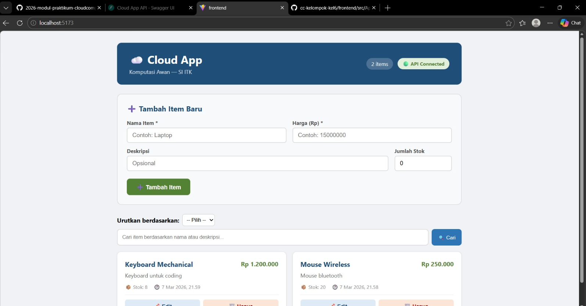
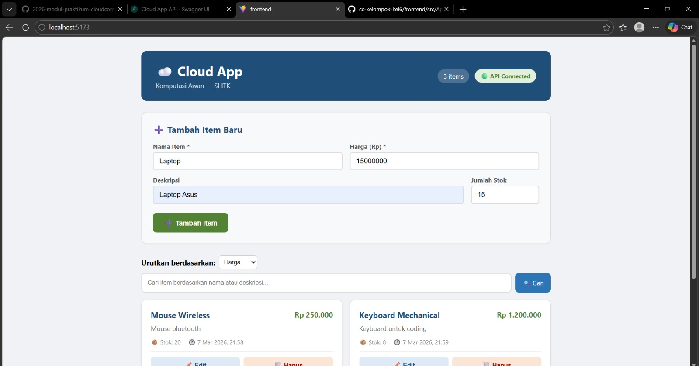
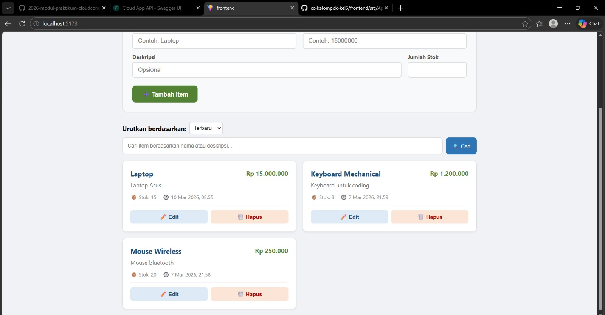
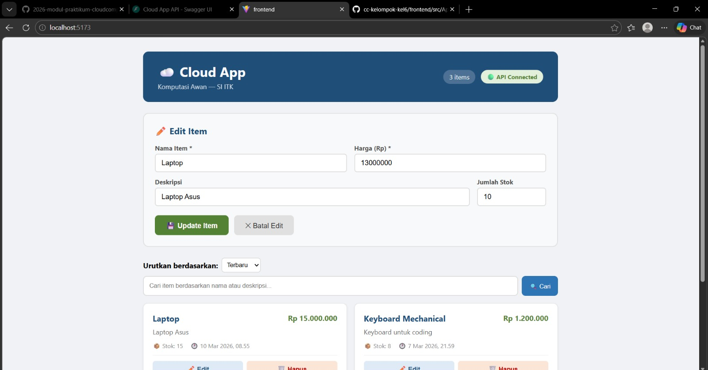
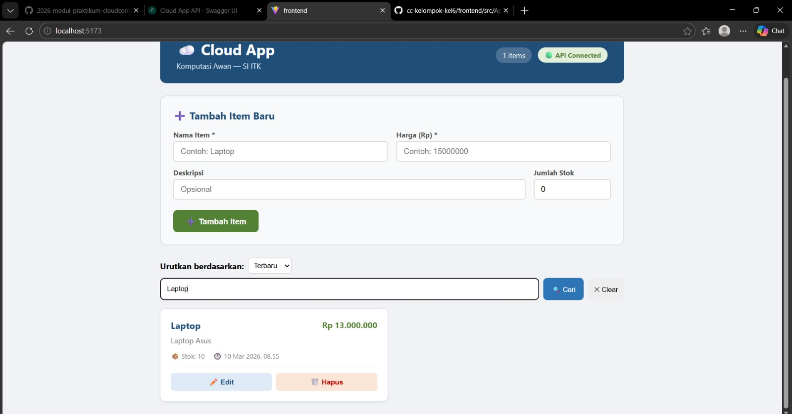
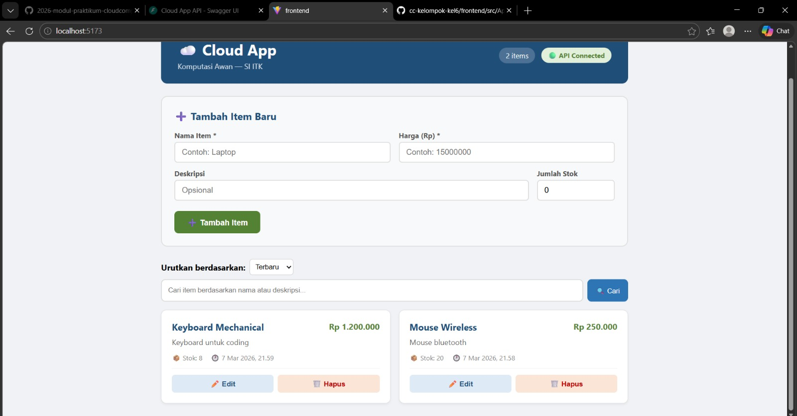
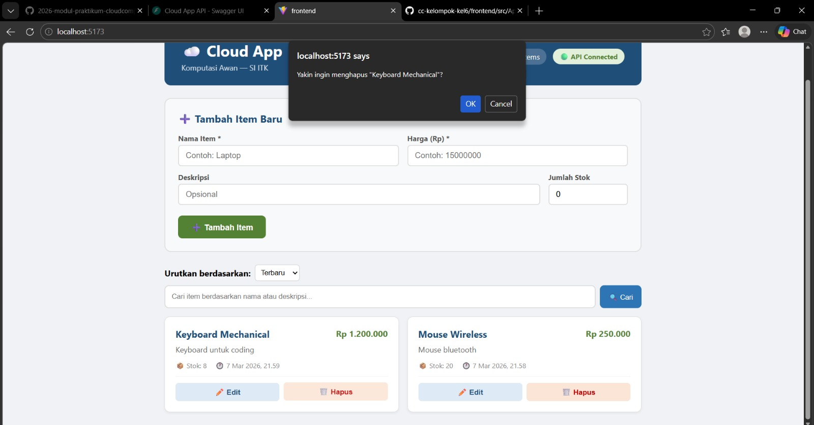
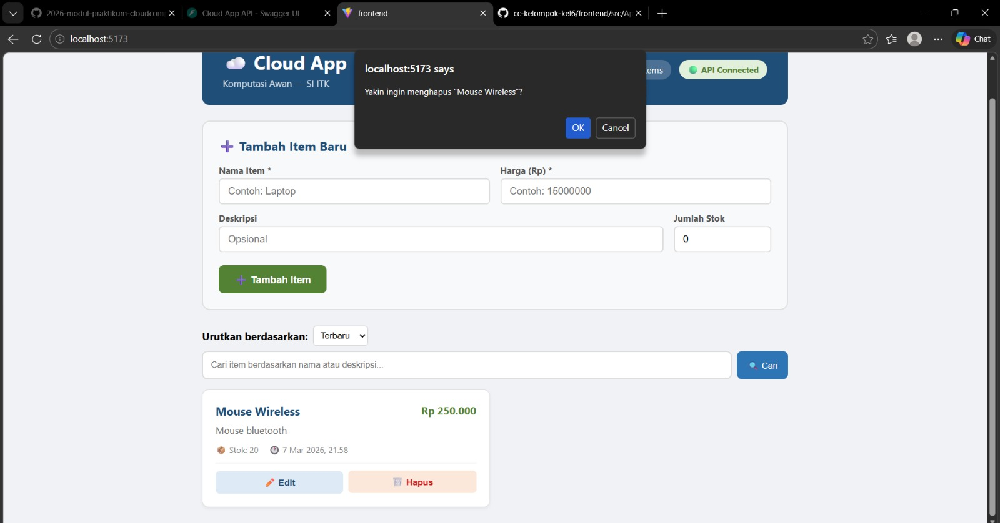
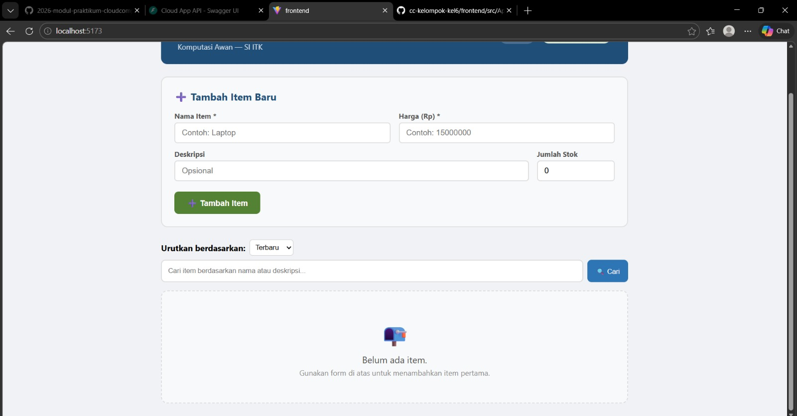

# 📄 Dokumentasi Pengujian UI Sistem

Dokumentasi ini berisikan hasil pengujian antarmuka pengguna (*User Interface*) untuk memastikan bahwa setiap fitur utama seperti menampilkan data, menambah data, mengedit data, mencari data, dan menghapus data dapat berjalan dengan baik sesuai dengan alur sistem.

---

Terdapat 10 alur pada sistem yang perlu dilakukan testing yaitu sebagai berikut.

1. **Cek status API**  
    Pada tahap ini dilakukan pengecekan apakah sistem berhasil terhubung dengan API atau *backend*.
    
    Berdasarkan gambar tersebut menunjukkan bahwa sistem menampilkan status API Connected yang menandakan bahwa sistem telah berhasil terhubung dengan API atau frontend berhasil berkomunikasi dengan backend.

    
2. **Items dari Modul 2 muncul di daftar**  
    Setelah koneksi API berhasil, sistem akan mengambil data item dari database dan menampilkannya pada daftar item di halaman utama. 
    
    Berdasarkan gambar tersebut menunjukkan bahwa sistem berhasil mengambil data item dari database modul 2 dan menampilkannya pada daftar item. Item yang terdapat pada modul 2 dan ditampilkan dalam daftar terdiri dari Keyboard Mechanical dan Mouse Wireless. 

3. **Tambah item baru via form**  
    Pada tahap ini, pengguna mencoba menambahkan data item baru melalui form input.
    
    Berdasarkan gambar tersebut, saya mencoba menambahkan item baru yaitu Laptop dengan deskripsi Laptop Asus seharga 15.000.000 dan memiliki stok sejumlah 15 buah. Kemudian mengklik tambah item untuk menyimpan data item tersebut dan sistem memproses permintaan penambahan item baru.

4. **Item muncul di daftar**  
    Setelah permintaan penambahan item baru sebelumnya telah berhasil maka item tersebut akan tersimpan dalam daftar item pada sistem. 
    
    Berdasarkan gambar tersebut menunjukkan bahwa item baru berhasil ditampilkan pada daftar item yang ada pada sistem, item tersebut berupa Laptop.

5. **Klik Edit pada item**  
    Pada tahap ini pengguna memilih salah satu item yang ada pada daftar dan mengklik tombol Edit.
    
    Berdasarkan gambar tersebut, setelah saya mengklik tombol edit maka sistem menampilkan halaman edit. Melalui halaman ini saya dapat mengubah data pada item Laptop.

6. **Form edit terisi data lama, ubah harga dan klik update**  
    Berdasarkan gambar pada test 5 menunjukkan bahwa sistem menampilkan halaman edit yang berisikan data lama dari item yang telah dipilih.
    
    Selanjutnya saya ingin mengubah harga Laptop dari 15.000.000 menjadi 13.000.000 dan mengubah jumlah stok yang awalnya berjumlah 15 sekarang hanya tersisa 10 buah. Setelah selesai mengubah, klik tombol edit agar sistem dapat mengirimkan permintaan untuk mengubah data item tersebut.

7. **Mencari item via SearchBar**  
    Pada tahap ini pengguna mencoba menggunakan fitur SearchBar untuk memudahkan dalam mencari item tertentu dengan memasukkan kata kunci.
    
    Berdasarkan gambar tersebut, saya ingin mencari item Laptop menggunakan fitur SearchBar dengan memasukkan kata kunci berupa Laptop. Sistem akan menampilkan daftar item yang sesuai dengan kata kunci pencarian, disini saya mencari Laptop sehingga yang tampil pada daftar item hanya Laptop saja yang menandakan bahwa SearchBar berhasil dijalankan.

8. **Hapus item, confirm dialog muncul**  
    Pada tahap ini pengguna menghapus item dengan mengklik tombol delete pada item yang ingin dihapus.
    
    Berdasarkan gambar tersebut, saya memilih item Laptop untuk dihapus dengan mengklik tombol delete dan sistem akan menampilkan sebuah konfirmasi kepada saya untuk menyetujui penghapusan pada item tersebut.

9. **Item hilang dari daftar**  
    
    Setelah saya menyetujui konfirmasi penghapusan item laptop, sistem akan memproses permintaan penghapusan yang telah saya kirimkan. Selanjutnya jika proses tersebut berhasil maka sistem akan memperbarui daftar item,  dimana item yang telah dipilih untuk penghapusan sebelumnya akan hilang dari daftar item.

10. **Hapus semua item, empty state muncul**  
    Pada tahap ini pengguna mencoba untuk menghapus semua item yang ada pada daftar item dalam sistem dengan mengklik tombol delete dan melakukan konfirmasi persetujuan penghapusan item. 
    
    
    Disini saya mencoba untuk menghapus 2 item yang tersisa sebelumnya dengan melakukan konfirmasi persetujuan penghapusan item-item. Kemudian sistem akan memproses permintaan tersebut.
    
    Setelah proses penghapusan yang dilakukan sistem berhasil, maka sistem tidak akan menampilkan daftar item kembali karena item yang ada sebelumnya telah dihapus dan saat ini sistem menampilkan sebuah empty state yang menunjukkan bahwa tidak ada item dalam sistem ini. 